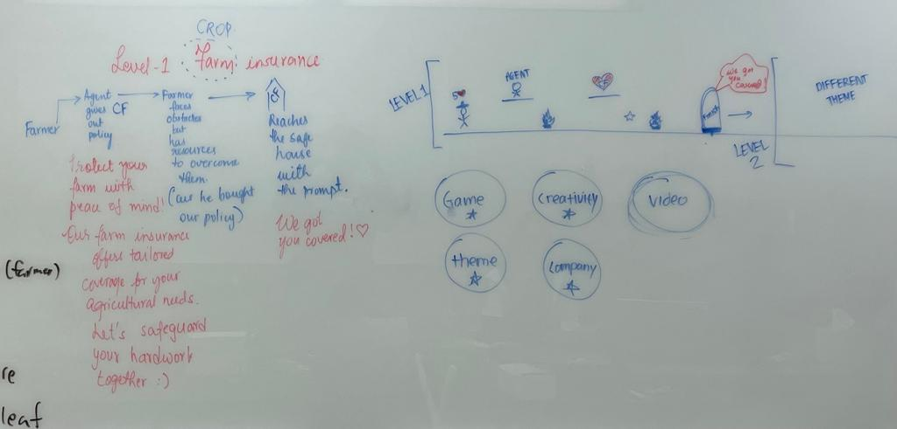

# COUNTRY Financial Hackathon-Research-Park 
Demo Video: https://youtu.be/nsN4cT2lHN8
# Insure-it

Insure-it is an engaging 2D Retro Arcade Game powered by the GDevelop framework. It features three levels focused on crop, medical and car insurance for a farmer.

## Installation

Insure-it can be played in multiple ways:
1. Web link and desktop executable file (.exe) format
2. JSON format and HTML5

## Controls

- Right-key: Move the player right
- Left-key: Move the player left
- Space-bar: Jump
- E-key: Throw a weapon (COUNTRY Financial Policy) to overcome obstacles and to talk to the COUNTRY agent
- Escape-key: Pauses and returns the player to the menu

## Features

- Farmer: Play as a farmer character in the first level
- Agent: Interact with the agent who delivers the insurance policies
- Star a.k.a Checkpoints: Brightens when the player passes it, marking the progress
- Heart: Each player starts with 5 lives. Touching an obstacle reduces a life. Reaching 0 lives returns the player to the last checkpoint.
- Corn: Collect >= 12 corns to advance to the next level
- Fire: Avoid fire obstacles in the first level
- Pill: Collect >= 11 pills to advance to the second level
- Virus: Avoid virus-spitting characters in the second level
- Wrench: Collect >= 12 wrenches to end the game
- Cars: Obstacles in the third level
- Door: Marks the finish point at the end of each level

## Initial Plan

## Levels

### Level 1 - Crop Insurance

A farmer is tasked to transport crops, but there are fire obstacles that the farmer needs to overcome to advance to the next level. In order to extinguish the fire, the farmer must not only meet with a COUNTRY Financial agent to purchase a crop insurance policy, but he must also collect at least 12 crop items. 

### Level 2 - Medical Insurance

Another character is exploring the city. However, the city is filled with people infected with a contagious virus, and the character needs to avoid these sick people. In the case of the character contracting this virus, the character must not only meet with a COUNTRY Financial agent to purchase a medical insurance policy, but the character must also collect at least 11 pill items.

### Level 3 - Car Insurance

The character is walking on the streets while surrounded by reckless drivers, and he needs to avoid them. In the case of a driver carelessly crashing into the character, the character must not only meet with a COUNTRY Financial agent to purchase a car insurance policy, but the character must also collect at least 12 wrenches. 

## Authors

- Ethan Handojo
- Janam Bagdai
- Yesui Dovchinsuren
- Sanjana Pai
- Hitesh Vijan

### Citations

- https://www.remove.bg/: Creates transparent background for input images
- https://pngtree.com/: Graphic Resources for Free Download
- https://www.pngwing.com/: Transparent background png images for designers
- GDevelop: Framwork used to create the game

### Acknowledgements
- We thank Research Park for presenting us with this opportunity
- Thanks to COUNTRY Financial Digitalab and our colleagues for their support
- A big thanks to our site director, Julia Hart for the encouragement and guidance throughout
- Thanks to James Kabbes for hosting the Research Park Hackathon
